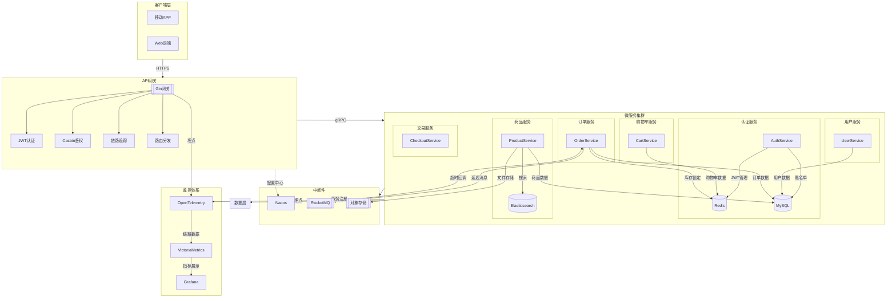
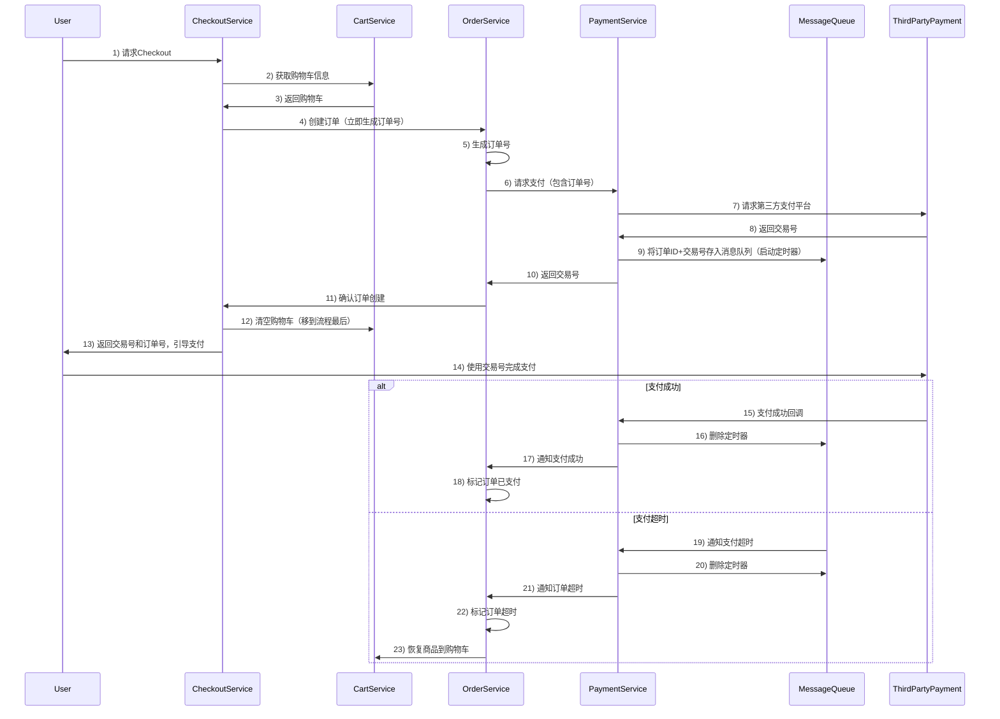

# 抖音商城微服务架构技术文档

## 一、项目概述
本项目是基于微服务架构的电商平台，采用云原生技术栈构建，支持高并发场景下的商品浏览、购物车管理、订单处理、支付对接等核心功能。系统通过服务解耦、弹性伸缩、全链路监控等特性保障高可用性。

## 二、技术架构设计

### 1. 整体架构图
```
[前端网关] -> [认证服务] -> [业务服务集群]
       |          |
       |          +-- [配置中心]
       |          +-- [注册中心]
       |
       +-- [消息队列] <- [支付服务]
       +-- [监控告警]
       +-- [链路追踪]
```





### 2. 服务划分
| 服务名称            | 协议   | 核心功能           |
|-----------------|------|----------------|
| AuthService     | gRPC | JWT签发/校验、黑名单管理 |
| CartService     | gRPC | 购物车增删改查        |
| OrderService    | gRPC | 订单生命周期管理       |
| ProductService  | gRPC | 商品CRUD、搜索服务    |
| CheckoutService | gRPC | 交易流程编排         |
| PaymentService  | gRPC | 支付网关对接         |
| UserService     | gRPC | 用户信息管理         |
| FrontendGateway | HTTP | API网关、认证鉴权、限流  |
### 3. 中间件矩阵
| 中间件          | 版本           | 用途                               |
|----------------|----------------|----------------------------------|
| Nacos          | 2.2.3          | 服务发现与动态配置                 |
| Redis          | 6.2            | 会话状态/黑名单缓存                 |
| RocketMQ       | 5.0            | 订单超时控制/削峰填谷               |
| Elasticsearch  | 8.17           | 商品搜索服务                       |
| VictoriaMetrics| latest         | 指标存储与分析                     |

## 三、核心模块详解

### 1. 认证鉴权体系
#### (1) JWT双校验机制
```go
func VerifyToken(token string) (claims *JWTClaims, err error) {
    // 1. 校验签名有效性
    // 2. 检查Redis黑名单
    // 3. 返回用户上下文
}
```

#### (2) Casbin动态权限管理
```yaml
# 策略模型
[request_definition]
    r = sub, obj, act

  [policy_definition]
    p = sub, obj, act

  [role_definition]
    g = _, _

  [policy_effect]
    e = some(where (p.eft == allow))

  [matchers]
    m = g(r.sub, p.sub) && RegexRouterMatcher(r.obj, p.obj) && RegexRouterMatcher(r.act, p.act)
```

### 2. 订单处理流程


### 3. 商品搜索服务
```go
func SearchProducts(req *pb.SearchReq) (*pb.SearchResp, error) {
    // 1. 构建ES多条件查询
    // 2. 添加分词处理
    // 3. 结果聚合返回
    // 4. 缓存热门搜索
}
```

## 四、系统亮点

### 1. 动态权限控制
- 实现正则表达式匹配的路由权限校验
- 支持策略热更新（变更后立即生效）
- 权限缓存优化

### 2. 分级黑名单管理
| 类型   | 存储位置 | 过期策略           | 适用场景         |
|--------|----------|--------------------|----------------|
| 短期   | Redis    | 自动过期           | 临时封禁       |
| 长期   | MySQL    | 手动解除+自动降级  | 严重违规       |

### 3. 全链路可观测性
- 集成OpenTelemetry实现全链路追踪
- 关键指标埋点（成功率/耗时/错误码）

### 4. 弹性搜索优化
- 基于IK分词器的中文搜索
- 搜索结果缓存策略
- 异步索引构建（Canal监听Binlog）

## 五、快速开始

### 1. 环境准备
```bash
# 启动基础设施
docker-compose up -d nacos mysql redis rocketmq
```

### 2. 服务启动
```bash
# 启动认证服务
cd app/auth && sh build.sh && cd ./output && sh bootstrap.sh

# 启动商品服务 
cd app/product && sh build.sh && cd ./output && sh bootstrap.sh

# 启动订单服务
cd app/order && sh build.sh && cd ./output && sh bootstrap.sh

# 启动支付服务
cd app/payment && sh build.sh && cd ./output && sh bootstrap.sh

# 启动前端网关
cd app/frontend && sh build.sh && cd ./output && sh bootstrap.sh

# 启动用户服务
cd app/user && sh build.sh && cd ./output && sh bootstrap.sh

# 启动购物车服务
cd app/cart && sh build.sh && cd ./output && sh bootstrap.sh

# 启动结算服务
cd app/checkout && sh build.sh && cd ./output && sh bootstrap.sh
```


## 六、监控体系
| 监控类型 | 工具              | 监控指标示例       |
|------|-----------------|--------------|
| 服务状态 | Nacos           | 服务实例数/健康状态   |
| 链路追踪 | Jaeger          | 调用链路/耗时分布    |
| 指标监控 | VictoriaMetrics | QPS/错误率/延迟分布 |
## 七、未来规划
1. 实现自动弹性伸缩（HPA）
2. 增加分布式事务支持（Saga模式）
3. 构建多级缓存体系
4. 完善混沌工程测试

---
**项目地址**: [github.com/douyin-shop/douyin-shop](https://github.com/douyin-shop/douyin-shop)  
**文档版本**: v1.0.0