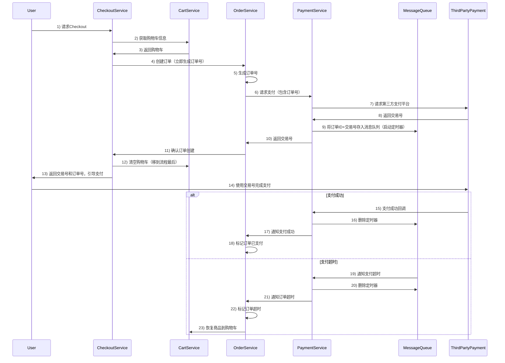
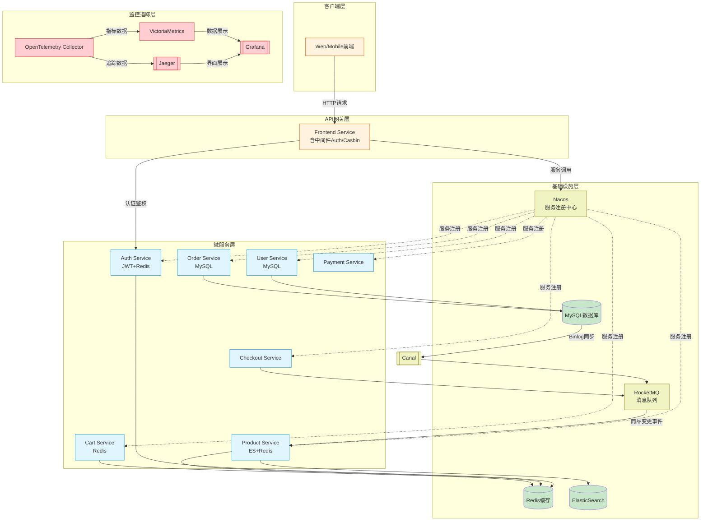

# 接口文档
```protobuf
syntax="proto3";

package auth;

option go_package="/auth";

service AuthService {
    rpc DeliverTokenByRPC(DeliverTokenReq) returns (DeliveryResp) {}
    rpc VerifyTokenByRPC(VerifyTokenReq) returns (VerifyResp) {}
    rpc Logout(LogoutReq) returns (LogoutResp) {}
    // 新增用户到黑名单
    rpc AddBlacklist(AddBlackListReq) returns (AddBlackListResp) {}
    // 删除黑名单用户
    rpc DeleteBlacklist(DeleteBlackListReq) returns (DeleteBlackListResp) {}
}

```
```protobuf

syntax = "proto3";

package cart;

option go_package = '/cart';

service CartService {
    rpc AddItem(AddItemReq) returns (AddItemResp) {}
    rpc GetCart(GetCartReq) returns (GetCartResp) {}
    rpc EmptyCart(EmptyCartReq) returns (EmptyCartResp) {}
}

```
```protobuf
syntax = "proto3";

package  checkout;

option go_package = "/checkout";

service CheckoutService {
  rpc Checkout(CheckoutReq) returns (CheckoutResp) {}
}
```


```protobuf

syntax = "proto3";

package order;

option go_package = "order";

service OrderService {
    rpc PlaceOrder(PlaceOrderReq) returns (PlaceOrderResp) {}
    rpc ListOrder(ListOrderReq) returns (ListOrderResp) {}
    rpc MarkOrderPaid(MarkOrderPaidReq) returns (MarkOrderPaidResp) {}
    // 新增取消订单方法
    rpc MarkOrderCanceled(MarkOrderCanceledReq) returns (MarkOrderCanceledResp) {}
}

```

```protobuf
syntax = "proto3";

package product;

option go_package = "/product";

service ProductCatalogService {
    rpc AddProduct(AddProductReq) returns (AddProductResp) {}
    rpc UpdateProduct(UpdateProductReq) returns (UpdateProductResp) {}
    rpc DeleteProduct(DeleteProductReq) returns (DeleteProductResp) {}
    rpc ListProducts(ListProductsReq) returns (ListProductsResp) {}
    rpc GetProduct(GetProductReq) returns (GetProductResp) {}
    rpc SearchProducts(SearchProductsReq) returns (SearchProductsResp) {}
}
```


```protobuf
syntax="proto3";

package user;

option go_package="/user";
service UserService {
    rpc Register(RegisterReq) returns (RegisterResp) {}  //注册服务/创建用户
    rpc Login(LoginReq) returns (LoginResp) {} //登录服务
    rpc Logout(LogoutReq) returns(LogoutResp){} //登出服务(服务已废弃,移到auth模块)
    rpc Delete(DeleteReq) returns(DeleteResp){} //删除用户
    rpc Update(UpdateReq) returns(UpdateResp){} //更新用户数据
    rpc Get(GetReq) returns(GetResp){} //获取用户数据
}
```

> 注意casbin权限校验在frontend网关微服务实现的

# Docker-Compose文件
```yaml
services:


    # 链路跟踪
    otel-collector:
        image: otel/opentelemetry-collector-contrib:0.52.0
        command: [ "--config=/etc/otel-collector-config.yaml", "${OTELCOL_ARGS}" ]
        volumes:
            - ./opentelemetry/otel-collector-config.yaml:/etc/otel-collector-config.yaml
        ports:
            - "1888:1888"   # pprof extension
            - "8888"   # Prometheus metrics exposed by the collector
            - "8889:8889"   # Prometheus exporter metrics
            - "13133:13133" # health_check extension
            - "4317:4317"   # OTLP gRPC receiver
            - "55679" # zpages extension
        depends_on:
            - jaeger-all-in-one
        restart: always

    # Jaeger
    jaeger-all-in-one:
        image: jaegertracing/all-in-one:latest
        restart: always
        environment:
            - COLLECTOR_OTLP_ENABLED=true
        ports:
            - "16686:16686"
            - "14268"
            - "14250:14250"
            - "6831:6831"
    #      - "4317:4317"   # OTLP gRPC receiver

    # Victoriametrics
    victoriametrics:
        container_name: victoriametrics
        image: victoriametrics/victoria-metrics
        ports:
            - "8428:8428"
            - "8089:8089"
            - "8089:8089/udp"
            - "2003:2003"
            - "2003:2003/udp"
            - "4242:4242"
        command:
            - '--storageDataPath=/storage'
            - '--graphiteListenAddr=:2003'
            - '--opentsdbListenAddr=:4242'
            - '--httpListenAddr=:8428'
            - '--influxListenAddr=:8089'
        restart: always

    # Grafana
    grafana:
        image: grafana/grafana:latest
        restart: always
        environment:
            - GF_AUTH_ANONYMOUS_ENABLED=true
            - GF_AUTH_ANONYMOUS_ORG_ROLE=Admin
            - GF_AUTH_DISABLE_LOGIN_FORM=true
        ports:
            - "3000:3000"
    nacos:
        image: nacos/nacos-server:v2.4.0
        container_name: nacos
        restart: always
        ports:
            - "8848:8848"
            - "9848:9848"
            - "9849:9849"
        volumes:
            -   ./nacos/logs:/home/nacos/logs
            -  ./nacos/data:/home/nacos/data
        environment:
            - PREFER_HOST_MODE=hostname
            - MODE=standalone
        networks:
            - micro-service-net
        # RocketMQ Nameserver
    rocketmq-namesrv:
        image: apache/rocketmq:5.3.1
        container_name: rocketmq-namesrv
        restart: always
        ports:
            - "9876:9876"
        command: sh mqnamesrv
        environment:
            - JAVA_OPT_EXT=-server -Xms512m -Xmx512m
        networks:
            - micro-service-net

    # RocketMQ Broker
    rocketmq-broker:
        image: apache/rocketmq:5.3.1
        container_name: rocketmq-broker
        restart: always
        ports:
            - "10909:10909"
            - "10911:10911"
            - "10912:10912"
        volumes:
            - ./rocketmq/broker/conf/broker.conf:/home/rocketmq/rocketmq-5.3.1/conf/broker.conf
        command: sh mqbroker -n rocketmq-namesrv:9876 -c ../conf/broker.conf
        depends_on:
            - rocketmq-namesrv
        environment:
            - JAVA_OPT_EXT=-server -Xms512m -Xmx512m
            - NAMESRV_ADDR=rocketmq-namesrv:9876
        networks:
            - micro-service-net

    # RocketMQ Dashboard
    rocketmq-dashboard:
        image: apacherocketmq/rocketmq-dashboard:latest
        container_name: rocketmq-dashboard
        restart: always
        ports:
            - "808:8080"
        environment:
            - JAVA_OPTS=-Drocketmq.namesrv.addr=rocketmq-namesrv:9876
        depends_on:
            - rocketmq-namesrv
        networks:
            - micro-service-net
    redis:
        image: redis:6.2.6
        restart: always
        container_name: redis
        ports:
            - "6379:6379"
        networks:
            - micro-service-net
    mysql:
        image: mysql:8.0 # 使用MySQL官方镜像，版本8

        restart: always # 容器退出后总是重启
        environment:
            MYSQL_ROOT_PASSWORD: 88888888 # 设置root用户的密码，生产环境中请使用更复杂的密码
            MYSQL_DATABASE: douyin-shop # 初始化时创建的数据库名称
            MYSQL_USER: douyin-shop # 创建的新用户
            MYSQL_PASSWORD: 88888888 # 新用户的密码
        ports:
            - "3306:3306" # 映射容器的3306端口到主机的3306端口
        volumes:
            - db_data:/var/lib/mysql # 挂载宿主机的目录到容器的MySQL数据目录，用于持久化数据
    elasticsearch:
        image: docker.elastic.co/elasticsearch/elasticsearch:8.17.1
        container_name: elasticsearch
        restart: always
        environment:
            - discovery.type=single-node
            - ES_JAVA_OPTS=-Xms512m -Xmx512m
            - xpack.security.enabled=false
        volumes:
            - ./tools/elasticsearch-analysis-ik-8.17.1/:/usr/share/elasticsearch/plugins/analysis-ik
        ports:
            - "9200:9200"
            - "9300:9300"
        networks:
            - micro-service-net

networks:
    micro-service-net:
        driver: bridge
volumes:
    db_data:


```


# 打包运行方法
```
cd app/{service}/
sh build.sh
cd output
sh bootstrap.sh
```
# 技术栈

使用了gin+grpc+gorm

1. 使用`lorgus`进行日志记录与日志切割
2. 使用`nacos`进行服务注册和服务发现
3. 使用`nacos`进行动态配置管理
4. 使用`golang-jwt`进行token生成校验与分发，使用`Redis`来记录登陆状态，防止异地登陆
5. 使用`casbin`进行权限管理，使用自定义函数进行基于`正则表达式`的权限校验，使用`CachedEnforcer` 减少数据库访问压力,使用`单例模式`以支持动态更新用户权限信息，当用户权限发生变化时，权限校验能够实时生效。
6. 黑名单管理
    1. 黑名单管理会分为长期用户和短期用户
    2. 短期封禁用户不存到`Mysql`中，直接在`Redis`中存储，降低`Mysql`存储压力
    3. 长期封禁用户存到`Mysql`中，如果用户登陆缓存不命中则会去Mysql中查找判断一下是否是长期封禁用户，如果是则添加一个短期`Redis`缓存，同时如果快到期就从数据库删除该黑名单用户，使其变为短期封禁用户，这样既减少了`Mysql`查找的压力，又减少了`Redis`的存储压力
7. 使用`bcrypt`进行用户密码加密，防止密码明文泄漏与密文碰撞攻击
8. 使用`OpenTelemetry`进行链路追踪和粒度埋点
9. 基于`Github Action`的`CI/CD`流水线自动部署
10. 基于`ElasticSearch`对商品进行模糊搜索
11. 基于`RabbitMq`对订单进行超时取消，对流量进行削峰填谷
12. 使用`OSS`进行静态资源存储
13. 使用`canal`进行数据库`Binlog`监听，用于实现ES与Mysql的同步操作

---


# Git规范

请不要在main分支上直接提交，提交代码需要：

1. 新建一个自己的开发分支
2. 确保开发分支必须已经合并了最新的main分支代码，如果没有请先pull
3. 开发完成后先推送到自己的开发分支
4. 提交Pull Request

注意事项：

1. Pull Request必须由团队中其他至少一人去进行Code Review，通过才可合并
2. 尽可能不要出现多个人开发同一个微服务的情况
3. 自己的微服务的函数，尤其是对其他微服务开放的RPC接口，尽量不要进行改动，这会带来开发上的问题

# 代码规范

1. 局部命名规范不做强制要求，但是函数、成员注意使用驼峰命名法，对外开放的函数要大写，否则无法对外开放，这是GO语言的要求
2. 请不要随便变动项目目录
3. 公共方法放到`common/`目录下，公共方法指的是与业务无关，但是可能多个微服务都可能使用的方法
4. 日志输出请注意规范，合理使用`Info`、`Debug`，开发环境的日志等级一般都是`Debug`，正式环境是`Info`，因此正式环境看不到`Debug`的输出，正式环境可以看到，开发环境的输出（就是各种调试过程的test）都用`Debug`

---

...待更新

# 需求文档

## 一、项目概述

1. 项目名称
   字节跳动青训营抖音商城项目
2. 项目背景

随着移动互联网的普及和消费者购物习惯的变化，社交电商呈现出蓬勃发展的趋势。抖音作为一款拥有庞大用户群体的短视频社交平台，具有巨大的电商潜力。通过搭建电商平台，抖音可以为用户提供更加丰富的购物体验，同时为商家提供新的销售渠道，实现用户、商家和平台的多赢局面。

1. 项目愿景

希望同学们可以通过完成这个项目切实实践课程中(视频中)学到的知识点包括但是不限于Go 语言编程，常用框架、数据库、对象存储，服务治理，服务上云等内容，同时对开发工作有更多的深入了解与认识，长远讲能对大家的个人技术成长或视野有启发。

1. 项目目标

一句话做一个“简易版”抖音商城。为用户提供便捷、优质的购物环境，满足用户多样化的购物需求，打造一个具有影响力的社交电商平台，提升抖音在电商领域的市场竞争力。

1. 涉及中间件
- MySQL -Redis -ElasticSearch

这里推荐使用Go生态进行实现（使用其他语言以及其他语言对应的技术生态也可以，这里不做任何限制）

Go推荐技术框架: [Hertz](https://github.com/cloudwego/hertz) [Kitex](https://github.com/cloudwego/kitex) Gorm GoRedis [Eino](https://github.com/cloudwego/eino)

## 二、技术需求

### （一）注册中心集成

1. 服务注册与发现
    1. 该服务能够与注册中心Nacos进行集成，自动注册服务数据。

### （二）身份认证

1. 登录认证
    1. 可以使用第三方现成的登录验证框架（CasBin），对请求进行身份验证
    2. 可配置的认证白名单，对于某些不需要认证的接口或路径，允许直接访问
    3. 可配置的黑名单，对于某些异常的用户，直接进行封禁处理（可选）
2. 权限认证（高级）
    1. 根据用户的角色和权限，对请求进行授权检查，确保只有具有相应权限的用户能够访问特定的服务或接口。
    2. 支持正则表达模式的权限匹配（加分项）
    3. 支持动态更新用户权限信息，当用户权限发生变化时，权限校验能够实时生效。

### （三）可观测要求

1. 日志记录与监控
    1. 对服务的运行状态和请求处理过程进行详细的日志记录，方便故障排查和性能分析。
    2. 提供实时监控功能，能够及时发现和解决系统中的问题。

### （四）可靠性要求（高级）

1. 容错机制
    1. 该服务应具备一定的容错能力，当出现部分下游服务不可用或网络故障时，能够自动切换到备用服务或进行降级处理。
    2. 保证下游在异常情况下，系统的整体可用性不会受太大影响，且核心服务可用。
    3. 服务应该具有一定的流量兜底措施，在服务流量激增时，应该给予一定的限流措施。

## 三、功能需求

**认证中心**

- 分发身份令牌
- 续期身份令牌（高级）
- 校验身份令牌

**用户服务**

- 创建用户
- 登录
- 用户登出（可选）
- 删除用户（可选）
- 更新用户（可选）
- 获取用户身份信息

**商品服务**

- 创建商品（可选）
- 修改商品信息（可选）
- 删除商品（可选）
- 查询商品信息（单个商品、批量商品）

**购物车服务**

- 创建购物车
- 清空购物车
- 获取购物车信息

**订单服务**

- 创建订单
- 修改订单信息（可选）
- 订单定时取消（高级）

**结算**

- 订单结算

**支付**

- 取消支付（高级）
- 定时取消支付（高级）
- 支付


该有的东西都有了，请你为我生成一个完整，详细，规范的文档，谢谢！

